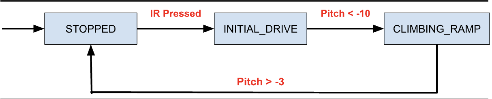

### Timing (Section 3.1)

> How many bytes of data must be transferred to read all three accelerometer axes?

6 bytes

> From your oscilloscope readings, roughly how long does one I2C transaction take when only the accelerometer is enabled?

75.2 ms

> What is the maximum rate at which you can read the accelerometer? What limits the speed?

416Khz, the speed of ACK signal limits the speed of the accelerometer output.

### Filtering (Section 3.2)

> What were your final selections for data rates and sensitivities? How did you decide on those values?

The selection for the data rates was ODR52, which sets the sample rate to 52Hz, which is 4 times more frequent than the default. The full scale range of +- 500 dps, which gives the gyro a sensitivity of 17.5 mdps/bit. By doing this, the gyroscope can react faster to the rapid change in angle. 

> What happens when you set kappa = 1 in your filter?

The algorithm uses accelerometer observation only. (1-k)θ'y when k = 1 would yield 0 as the gyro correction.

> What happens when you set kappa = 0 in your filter?

The algorithm uses gyroscope observation only. (k)θky when k = 0 would yield 0 as the accelerometer correction.

> What was your final choice for kappa? Why did you select that value?

The final choice for k is 0.5. This is because it accounts for the accelerometer and gyroscope observations equally in the correction calculation.

### Challenge (Section 4)

> Draw out the relevant parts of the state machine for the ramp detection.

### Contributions

> Briefly describe each student’s contribution and participation for this lab. In addition, divide 100 points among the team members based on their individual contributions to the lab assignment. Each team member should be allocated a percentage of the total points earned by the team. This will allow us to evaluate the effort and participation of each team member in the assignment.

Everyone did the same amount of work:

Ao Jiang = 25%
Brianna Sahagian = 25%
Eleanor Foley = 25%
Connor Thompson = 25%
